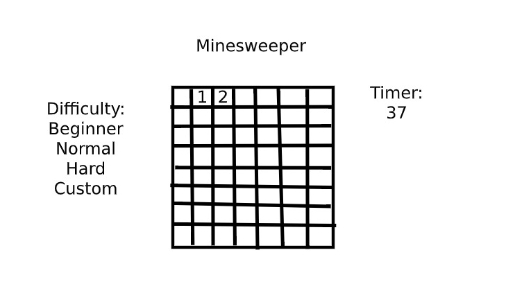

Minesweeper is a puzzle game in which the goal is to avoid mines by uncovering tiles via clicking revealing blank and numbered tiles. The numbered tiles represent how many mines that square is touching with up to 8 possibilites. If the player clicks a square covering a mine they explode and the player loses. Squares the player think contain mines can be marked with flags preventing them from being clicked accidentally. The player wins when either every bomb is marked with a flag, or every none bomb square is clicked and uncovered. Increasing difficulty increases board size and relative amount of bombs. Custom board size and bomb count is also a possible mode I'd like to attempt. A timer is present to show how long it took to complete the board and for players to attempt to go faster on subsequent attempts.

The game will default to beginner mode with a boardsize of 10 tiles by 8 tiles with 10 bombs. If the player chooses a more difficult setting (sizes TBD) the actual screenspace the board takes up won't change but the tiles will resize to fit. Once the player has chosen a difficulty and pressed start, the timer will begin ticking. If the player clicks a mine all mines are revealed (possibly with some kind of fluffy animation) and the player loses. (bummer) If the player clicks a completely empty tile, all empty tiles around that tile are revealed extending until numbers are hit. If the player clicks a numbered tile, only that tile is clicked. When the player suspects a tile to be a bomb they can right click it to plant a flag  and prevent further clicks on it. If all mines are marked, or every tile without a mine is revealed, stop timer and player wins.

init fills board section with 10 columns and 8 rows by default, it should store last game difficulty selection and displays that instead or if the player chooses a new difficulty it reruns init (going to have to think this part out) to resize board and regen bombs. Tiles default to displaying unclicked tile image. Sets timer to 0 and the flag and bomb count to the default for the current boardsize. 2 random numbers generated for each bomb to determine bomb placement using a 2d array. (row and column) An event handler on the start button starts timer and cues render to display it on screen. an eventlistener on the board sends a function which tile was clicked. the function will check if that tile is a bomb, a number, or an empty tile. If it's a bomb, it will call a function that set's all bombs to visible and cues render to reveal the bombs, and a message saying game over. If it's a number the function will cues render to reveal the tile. If it's a blank tile, another function will be called that checks adjacent tiles if, numbers are found it will cues render to reveal those tiles, if further blank tiles are found a counter will be raised. and the tiles stored. function will repeat until counter returns 0 (no new blank tiles found). If player right clicks a tile a function will cues render to make tile a flag and render that tile unclickable, except by right clicks. play continues till a bomb is clicked, or a win condition function that will check if all bombs are marked or all non-bomb tiles are revealed breaks tells the game to cues whatever end result. once game ends timer stops and appropriate win/lose message is displayed by render.

timer?

possible constants:

could make the board an object and set each square as a property with x and y coordinates, adding and removing squares as needed, not sure what else I could make constant. Will have to think more.

possible variables:  
boardColumns   
boardRows  
flags  
bombs   
currentRevealedTiles

possible functions:

init Function

render Function

testWinCon function

getAdjacent function

changeBoard function

makeBombs function 

