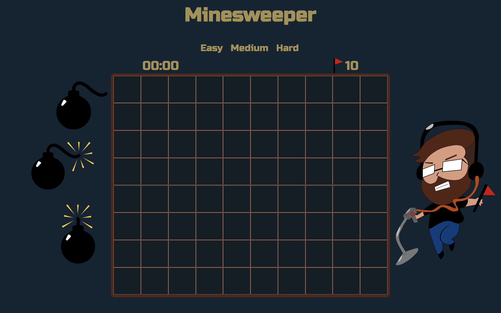
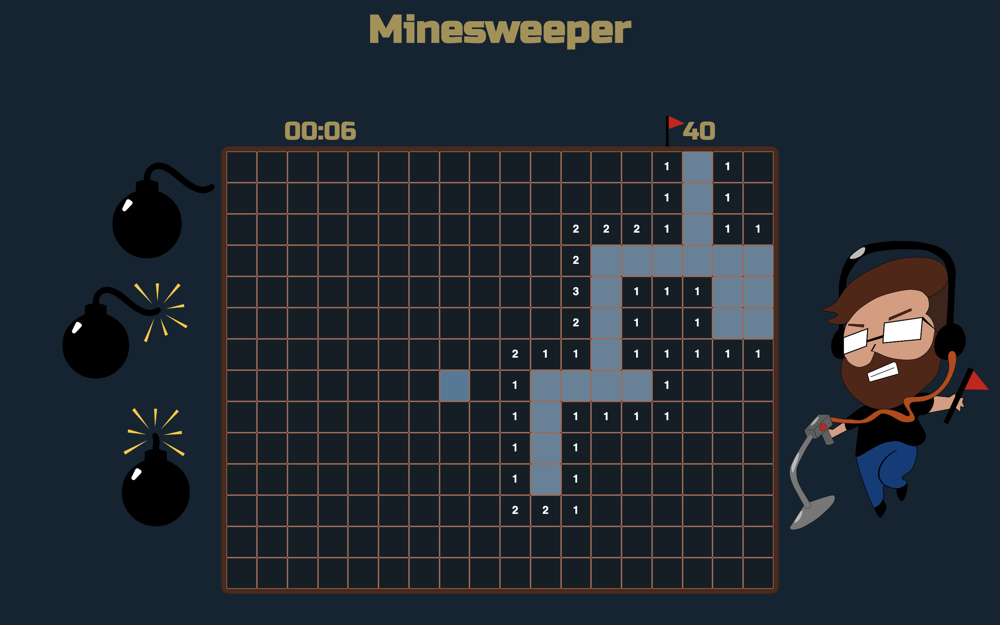

# Minesweeper

Minesweeper is a puzzle game in which the goal is to avoid mines by uncovering tiles via clicking, revealing blank and numbered tiles. The numbered tiles represent how many mines that square is touching with up to 8 possibilites. If the player clicks a square covering a mine they explode and the player loses. Squares the player think contain mines can be marked with flags preventing them from being clicked accidentally. The player wins when every none bomb square is clicked and uncovered. Increasing difficulty increases board size and relative amount of bombs. A timer is present to show how long it took to complete the board and for players to attempt to go faster on subsequent attempts.

This version of Minesweeper was written with JavaScript, HTML, and CSS.

https://matthew-coalson.github.io/MINESWEEPER-BROWSER-GAME/

Get started by choosing a difficulty and clicking away. Numbered tiles represent the total number of bombs next to that square. Good luck and avoid those bombs!

Next Steps: I would like to add sound, a time delay and possibly animations to bomb reveals, and make it more mobile friendly.

